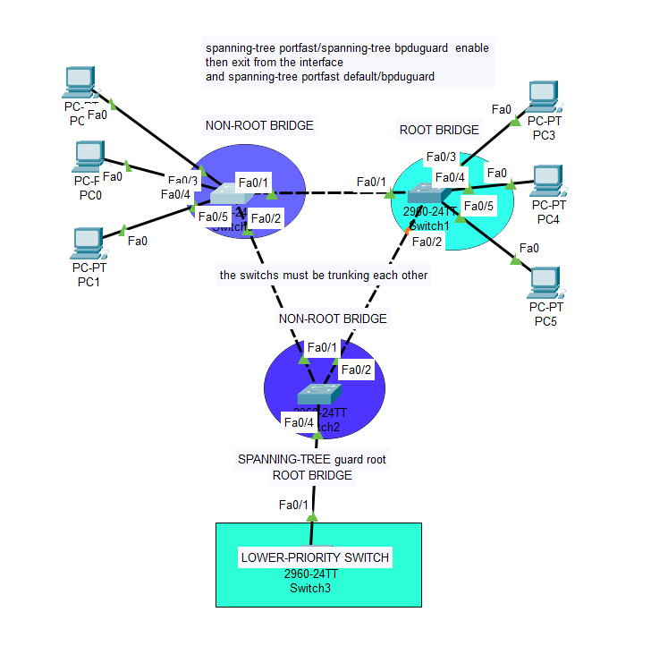
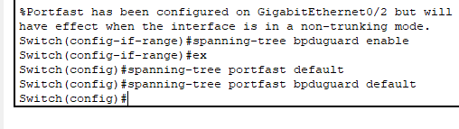
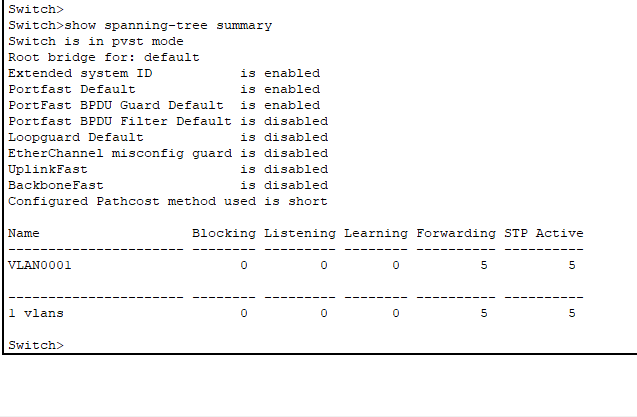
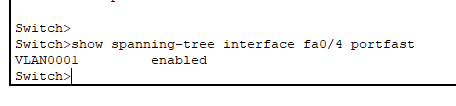

# Spanning Tree Protocol (STP) Configuration Lab

## Overview
This repository contains a network lab demonstrating Spanning Tree Protocol (STP) configuration across multiple Cisco switches. The lab showcases proper STP implementation with root bridge election, PortFast configuration, and BPDU guard settings.

## Network Topology
The network consists of three switches configured in a hierarchical spanning tree topology:
- **Switch3** (2960-24TT) - Configured as Root Bridge with lower priority
- **Switch1** (2960-24TT) - Root Bridge candidate  
- **Switch2** (2960-24TT) - Non-Root Bridge



## Key Features
- **Root Bridge Configuration**: Switch hierarchy with designated root bridge
- **PortFast**: Enabled on edge ports (Fa0/4) for faster access port transitions
- **BPDU Guard**: Configured on PortFast-enabled interfaces to prevent bridging loops
- **PVST Mode**: Per-VLAN Spanning Tree implementation
- **Trunk Configuration**: Inter-switch links properly configured as trunks

## Configuration Highlights

### PortFast Configuration
```
spanning-tree portfast default
spanning-tree portfast bpduguard default
```
PortFast is enabled on GigabitEthernet0/2 and configured to only take effect when the interface is in non-trunking mode.



### Spanning Tree Status
- **Extended System ID**: Enabled
- **PortFast Default**: Enabled
- **PortFast BPDU Guard**: Enabled
- **BPDU Filter**: Disabled
- **LoopGuard**: Disabled
- **UplinkFast**: Disabled
- **BackboneFast**: Disabled



### VLAN Configuration
- VLAN0001 showing proper STP state with 5 forwarding and 5 active ports



## Network Diagram
The topology includes:
- Multiple PCs connected to edge switches
- Root bridge at the bottom of the hierarchy (Switch3)
- Non-root bridges forming the upper layer
- Trunk links between switches with proper STP states

## Learning Outcomes
This lab demonstrates:
1. How to configure and verify STP in a multi-switch environment
2. Proper use of PortFast for end-user devices
3. BPDU Guard implementation for network security
4. Root bridge election and path selection
5. Prevention of Layer 2 loops in redundant topologies

## Commands Used
- `spanning-tree portfast`
- `spanning-tree portfast bpduguard enable`
- `show spanning-tree summary`
- `show spanning-tree interface`
- `switchport mode access`

## Warning Notes
⚠️ **Important**: PortFast should only be enabled on ports connected to single hosts. Connecting hubs, concentrators, switches, or bridges to PortFast-enabled interfaces can cause temporary bridging loops.

## Lab Environment
- Cisco IOS switches (2960 series)
- PVST+ spanning tree mode
- Multiple VLANs support
- Access and trunk port configurations

## Repository Structure
```
.
├── assets/           # Screenshots and diagrams
│   ├── portfast-config.png
│   ├── interface-status.png
│   ├── stp-summary.png
│   ├── topology-diagram.png
│   └── range-config.png
├── configs/          # Switch configuration files
├── topology/         # Network topology diagrams
└── README.md         # This file
```

## Getting Started
1. Review the network topology diagram
2. Examine the configuration files in the `configs/` directory
3. Follow the step-by-step implementation guide
4. Verify spanning tree operation using show commands

## License
Educational/Lab purposes

---
*This lab demonstrates best practices for Spanning Tree Protocol configuration in enterprise networks.*
